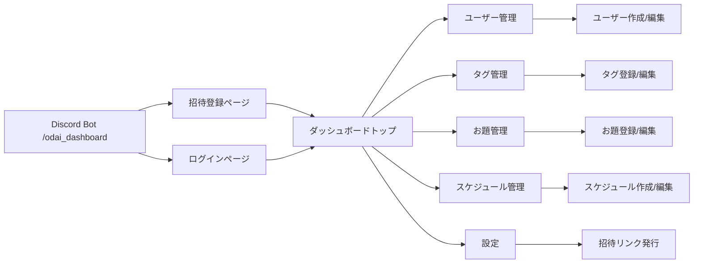

# Dashboard 画面遷移図・ワイヤーフレーム

## 1. 画面遷移図



## 2. ワイヤーフレーム

### 2.1 招待登録ページ

```text
+---------------------------------------------------------+
| Header: Dashboard / Logout                              |
+---------------------------------------------------------+
| 招待ユーザー名: [___________]                             |
| ロール: [admin / user]                                  |
|                                                         |
| パスワード: [___________]                                |
| パスワード確認: [___________]                            |
|                                                         |
| [登録ボタン]                                             |
|                                                         |
| エラーメッセージ:                                       |
| 例: 招待トークンが無効または期限切れです              |
+---------------------------------------------------------+
```

### 2.2 ログインページ

```text
+---------------------------------------------------------+
| Header: Dashboard / Login                                |
+---------------------------------------------------------+
| ユーザー名: [___________]                                |
| パスワード: [___________]                                |
|                                                         |
| [ログイン]                                               |
|                                                         |
| 招待登録はこちら: [招待リンクへ]                         |
|                                                         |
| エラーメッセージ:                                       |
+---------------------------------------------------------+
```

### 2.3 ダッシュボードトップ

```text
+---------------------------------------------------------+
| Header: Server Name | User Name | Role | Logout         |
+---------------------------------------------------------+
| Sidebar:                      | Main Content           |
| - Dashboard                  | + Summary cards        |
| - ユーザー管理               |   - 登録お題数         |
| - タグ管理                   |   - 有効スケジュール数 |
| - お題管理                   |   - 投稿先チャンネル数 |
| - スケジュール管理           |   - 最近の投稿状況     |
| - 設定                       | + クイックリンク       |
|                              |   - ユーザー管理       |
|                              |   - タグ管理           |
+---------------------------------------------------------+
```

### 2.4 ユーザー管理ページ

```text
+---------------------------------------------------------+
| Header / Breadcrumb: Dashboard > ユーザー管理           |
+---------------------------------------------------------+
| [ユーザー作成] [フィルタ]                               |
|                                                         |
| Table:                                                  |
| ID | ユーザー名 | 役割 | 作成日時 | 更新日時 | 操作   |
| 1  | alice     | admin | ...      | ...      | 編集 削除 |
| 2  | bob       | user  | ...      | ...      | 編集 削除 |
|                                                         |
| Modal / Form:                                           |
| - ユーザー名                                          |
| - パスワード                                          |
| - 役割                                               |
| [保存]                                                |
+---------------------------------------------------------+
```

### 2.5 タグ管理ページ

```text
+---------------------------------------------------------+
| Header / Breadcrumb: Dashboard > タグ管理               |
+---------------------------------------------------------+
| [タグ追加] [検索]                                       |
|                                                         |
| Table:                                                  |
| タグ名 | 説明 | 操作                                |
| 下ネタ   | 禁止タグ | 編集 削除                    |
| 日常     | 使いやすい | 編集 削除                  |
|                                                         |
| Form:                                                  |
| - タグ名                                              |
| - 説明                                                |
| [保存]                                                |
+---------------------------------------------------------+
```

### 2.6 お題管理ページ

```text
+---------------------------------------------------------+
| Header / Breadcrumb: Dashboard > お題管理               |
+---------------------------------------------------------+
| [お題追加] [タグフィルタ] [使用済みフィルタ]           |
|                                                         |
| Table:                                                  |
| ID | ファイル名 | タグ | 使用状況 | 登録日時 | 操作     |
| 1  | odai1.png  | 日常 | 未使用   | ...      | 編集 削除 |
|                                                         |
| Form:                                                  |
| - 画像アップロード                                    |
| - タグ選択                                            |
| [保存]                                                |
+---------------------------------------------------------+
```

### 2.7 スケジュール管理ページ

```text
+---------------------------------------------------------+
| Header / Breadcrumb: Dashboard > スケジュール管理       |
+---------------------------------------------------------+
| [スケジュール追加] [フィルタ]                           |
|                                                         |
| Table:                                                  |
| ID | チャンネル | 時刻 | 有効 | タグモード | タグリスト | 操作 |
| 1  | #general  | 12:00 | ON   | all      | -          | 編集 削除 |
|                                                         |
| Form:                                                  |
| - 投稿先チャンネル                                    |
| - 時刻                                               |
| - 有効 / 無効                                         |
| - タグモード                                         |
| - タグリスト                                         |
| [保存]                                                |
+---------------------------------------------------------+
```

### 2.8 設定ページ

```text
+---------------------------------------------------------+
| Header / Breadcrumb: Dashboard > 設定                   |
+---------------------------------------------------------+
| Server Info                                              |
| - Guild ID: 1234567890                                   |
| - Bot Enabled: ON                                        |
| - 招待リンク発行ボタン                                  |
|                                                         |
| Dashboard Settings                                       |
| - タイムゾーン                                           |
| - その他設定                                             |
| [保存]                                                  |
+---------------------------------------------------------+
```

## 3. 画面遷移と API まとめ

| 画面 | URL | 使用 API |
|---|---|---|
| 招待登録 | `#/register` | `POST /api/guilds/{guild_id}/auth/register` |
| ログイン | `#/login` | `POST /api/guilds/{guild_id}/auth/login` |
| ダッシュボードトップ | `#/dashboard` | `GET /api/guilds/{guild_id}/dashboard-summary` |
| ユーザー管理 | `#/dashboard/users` | `GET`/`POST`/`PUT`/`DELETE /api/guilds/{guild_id}/auth/users` |
| タグ管理 | `#/dashboard/tags` | `GET`/`POST`/`PUT`/`DELETE /api/guilds/{guild_id}/tags` |
| お題管理 | `#/dashboard/odai` | `GET`/`POST`/`PUT`/`DELETE /api/guilds/{guild_id}/odai` |
| スケジュール管理 | `#/dashboard/schedules` | `GET`/`POST`/`PUT`/`DELETE /api/guilds/{guild_id}/schedules` |
| 設定 | `#/dashboard/settings` | `GET`/`PUT /api/guilds/{guild_id}/settings` |

## 4. 実装メモ

- `guild_id` はクエリまたはユーザーセッションで保持する
- `access_token` は `Authorization: Bearer` で送信する
- 画面は `admin`/`user` で表示制御する
- 招待リンクは `DASHBOARD_BASE_URL` から生成される
- 招待ページは `invite_token` を隠しフィールドとして保持する
